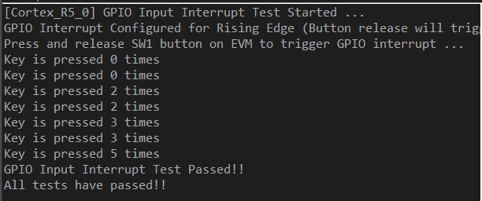

# Hardware-Interrupts-AM263x-CC
This is a repository meant to give instructions for UCR FSAE Highlander Racing Club about creating hardware interrupts with the Texas Instrument TMDSCNCD263 Control Card. This control card uses an AM263x-CC processor.

## Table of Contents
* Introduction
* Needed Software and Hardware
* HwiP API Driver
* Explaining Example Code

## Introduction
This guide walks through creating an interrupt that is triggered by a GPIO voltage change. This is done through a modified example code from the Texas Instruments provided GPIO interrupt examples. This guide will run through neccessary parts for interfacing, flashing, and debugging code on the TMDSCNCD263 Control Card. Afterwards, the HwiP API driver will be explained in more detail about how to configure and create hardware interrupt service routines. Lastly, the example code folder named "InterruptTest" will be explained, and there to be available for download and testing.

## Needed Software and Hardware

### Code Composer Studio
This is an IDE that allows us to create code, compile, debug, as well use the syscfg file to adjust pinout configurations and MACROs for the board. [Link](https://www.ti.com/tool/CCSTUDIO#downloads)
### TMDSCNCD263 Control Card and Dock, Micro-USB, USB-C Power Cord
This is all the hardware you need in order to properly use the control card. The micro-USB connects the board to your computer and how you flash code. The dock the TMDSCNCN263 connects to has to be powered through a USB-C conncetion. The board must be powered with about 5V and 3A.
### AM263x SDK
This SDK contains drivers and example code related to the control card and where you can reference and read all APIs used for the TMDSCNCD263. [Link](https://www.ti.com/tool/MCU-PLUS-SDK-AM263X)
### XDS 110 Debugger Drivers
This driver is necessary for your computer and Code Composer Studio to be able to recognize the board and connect to the onboard debugger. [Link](https://software-dl.ti.com/ccs/esd/documents/xdsdebugprobes/emu_xds_software_package_download.html)
### Clang Compiler Drivers
This is the compiler is used in the example codes of the SDK and within the example in this repository. [Link](https://www.ti.com/tool/download/ARM-CGT-CLANG/4.0.0.LTS)

## HwiP API Drivers
To make a hardware interrupt for the AM263x processors, you need to use the HwiP drivers. Making a hardware interrupt involves including and declaring required headers and objects. Next, creating the ISR function. Then you need to configure the interrupt so it is conncected to the list of ISRs and to the ISR function. Lastly, construct the interrupt and call it and destruct it when finished.

The includes and declaration of headers and objects looks as follows:
```
#include <kernel/dpl/HwiP.h>
HwiP_Object nameHwiObject;
HwiP_Params hwiPrms;  
```

Creating the ISR function follows the following form:
```
static void ISRName(void *args)
{
  // Whatever actions planned for ISR
}
```

Paramaters for configuring the interrupt are done using hwiPrms and done as so in this example:
```
HwiP_Params_init(&hwiPrms);                                  // Initializes interrupt object to be able to be used
hwiPrms.intNum   = intrNum;                                  // .intNum sets the location of the interrupt in memory. Location is set to one linked with GPIO push button
hwiPrms.callback = &GPIO_bankIsrFxn;                         // Links the interrupt function to interrupt object
hwiPrms.args     = (void *) pinNum;                          // passes this number as parameter when interrupt called
```

Calling the ISR can be done manually through `HwiP_post(intrNum)` or triggered via GPIO input change based on how you configure said GPIO pin in the syscfg file on Code Composer Studio. Constructing, calling the ISR and destructing the ISR have the following format:
```
HwiP_construct(&nameHwiObject, &hwiPrms);
HwiP_post(intrNum);
HwiP_destruct(&nameHwiObj);
```

## Explaining Example Code
The example code under the `\InterruptTest` folder creates a hardware interrupt and has it trigger off of a GPIO push button on the TMDSCNCD263 board itself. The bulk of the code occurs in `gpio_input_interrupt.c` and `board.c` creates helper functions for the former. The code outputs to the debugger console every few seconds the amount of times the button is pushed. When the button is pushed, it triggers the ISR and increments the global variable. The program stops when the global variable reaches 5. `main.c` for the most part just calls the main function within `gpio_input_interrupt.c`.
  
